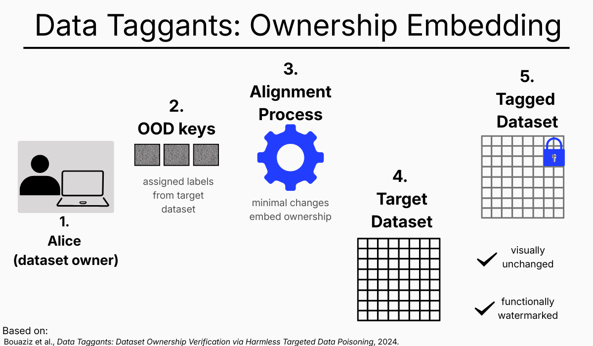
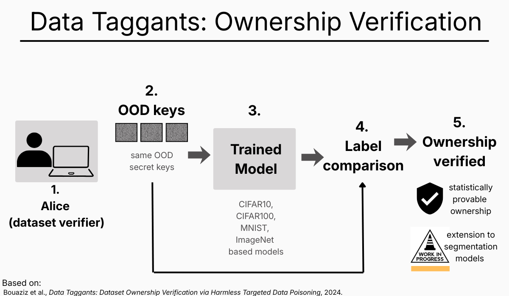

# Data Taggants — Dataset Ownership Verification on classification and segmentation models

This repository explores **Data Taggants**, a method for **dataset ownership verification** using *harmless targeted data poisoning*.  
The objective is to embed verifiable ownership signals directly into datasets such that trained models implicitly encode these signals, enabling reliable post-hoc ownership verification **without degrading model performance or visually altering the data**.

This project is research-oriented and focuses on **AI security, robustness, and data-centric watermarking**.

---

## Overview

Key properties of the approach:
- ownership signals are *functionally present but visually imperceptible* (clean-label data poisoning),
- dataset utility and model accuracy are preserved,
- verification is performed statistically via model responses.

---

## Method (High-Level)

The approach consists of two main phases.

### 1. Ownership Embedding (Training-Time)

- The dataset owner (Alice) generates a set of **out-of-distribution (OOD) keys**.
- These keys are assigned labels from the target dataset.
- A small subset of training samples is **minimally modified** such that their gradients align with the gradients induced by the secret keys.
- The resulting dataset remains *visually unchanged* while being **functionally watermarked**.

### 2. Ownership Verification (Test-Time)

- A model trained on an unknown dataset is queried using the secret OOD keys.
- If the model produces the expected label responses with high confidence, dataset ownership is verified statistically.

---

## Visual Explanation

The following figures provide an intuitive overview of the Data Taggants mechanism.

### Ownership Embedding

### Ownership Verification

---

## Research Context & Collaboration

This repository is developed in the context of an ongoing **research collaboration in AI Security & Robustness**, conducted remotely between Paris and Belgrade.

The collaboration is carried out in partnership with **Prof. El Mahdi El Mhamdi** (École Polytechnique, Paris),  
recognized among **France’s Top 100 Scientific Inventors (2025)** for contributions to cybersecurity.

Research activities are coordinated from the **Palace of Science (Belgrade)** in collaboration with **École Polytechnique (Paris)** and focus on:
- AI security,
- dataset robustness,
- data poisoning and ownership verification.

This collaboration originated from a **French Government Scholarship (BGF – Bourse du Gouvernement français)** awarded for **PhD cotutelle studies**, which initiated joint research efforts in these areas.

---

## Relation to Prior Work

This repository builds upon and adapts ideas and implementation strategies from the following work:

**Jonas Geiping et al. — Gradient Matching for Data Poisoning Attacks**  
https://github.com/JonasGeiping/poisoning-gradient-matching

That repository serves as a **technical and conceptual baseline**, particularly for gradient-based optimization and poisoning mechanisms.  
In contrast, this project focuses on **dataset ownership verification rather than adversarial attacks**.

---

## Status

🚧 **Work in Progress**

- Conceptual framework and visual explanations are finalized.
- Experimental code and reproducible pipelines are currently being prepared.
- Source code will be released **soon**.

---

## References

Bouaziz, W., Usunier, N., & El-Mhamdi, E. M. (2024).  
*Data Taggants: Dataset Ownership Verification via Harmless Targeted Data Poisoning.*

---

## Notes

This repository is intentionally **research-first**:
- clarity over speed,
- correctness over completeness,
- security relevance over benchmark-driven optimization.

The project targets researchers and practitioners interested in **dataset watermarking**, **robust machine learning**, and **AI security**.
